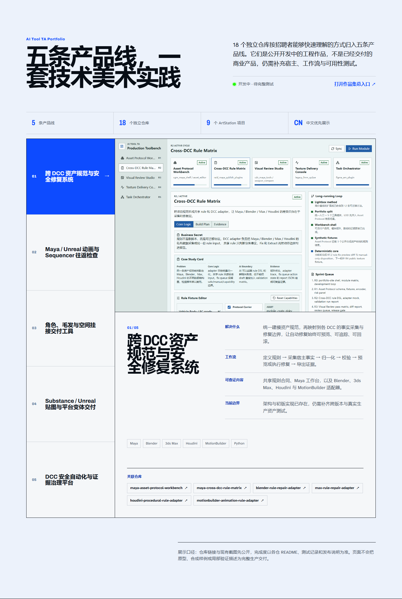
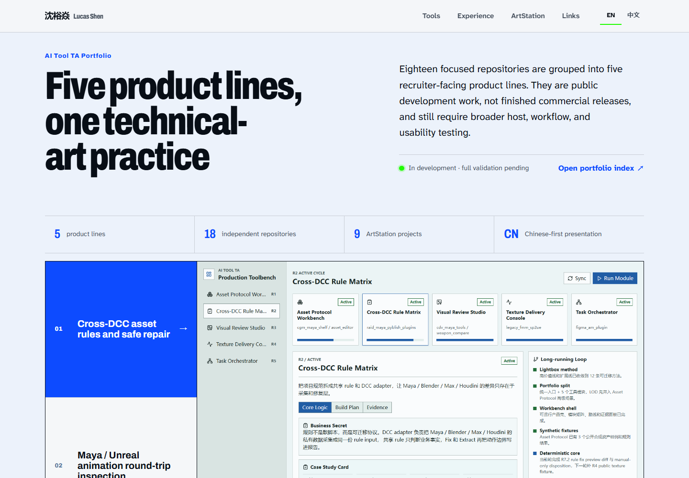

# 沈裕焱 · AI 工具技术美术作品集

[在线主页](https://ubik42.github.io/) · [English](#english)

这是沈裕焱（Lucas Shen）的个人静态作品集主页，面向国内技术美术、工具管线、引擎工具与 AI 工具岗位。网站默认显示中文，并提供完整英文切换。

> 当前状态：五条产品线及其独立仓库已经公开索引，但大部分子工具仍处于开发、拆分或验证阶段。页面中的截图用于展示现有界面与交互方向，不代表已经完成生产级交付。


## 作品集结构

简历与主页不逐项罗列 18 个子仓，而是将它们组织为五条产品线。九项技术美术作品使用原 Notion 图文和图片顺序在站内展示，游戏与其他项目排在其后。

| 产品线 | 重点能力 | 独立仓库 |
| --- | --- | --- |
| 跨 DCC 资产规范与安全修复系统 | Maya 工具、跨 DCC 规则 DSL、可预览与可回滚修复 | [Asset Protocol](https://github.com/Ubik42/maya-asset-protocol-workbench)、[Rule Matrix](https://github.com/Ubik42/maya-cross-dcc-rule-matrix)、[Blender](https://github.com/Ubik42/blender-rule-repair-adapter)、[3ds Max](https://github.com/Ubik42/max-rule-repair-adapter)、[Houdini](https://github.com/Ubik42/houdini-procedural-rule-adapter)、[MotionBuilder](https://github.com/Ubik42/motionbuilder-animation-rule-adapter) |
| Maya / Unreal 动画与 Sequencer 往返检查 | 动画管线、Sequencer、帧级验证、Socket 与运行时挂接 | [Sequence Inspector](https://github.com/Ubik42/level-sequence-roundtrip-inspector)、[Socket & Animation Bridge](https://github.com/Ubik42/ue-socket-anim-attach-bridge) |
| 角色、毛发与空间挂接交付工具 | 角色标定、Groom、Control Rig、Pose 与空间意图 | [Character Calibration](https://github.com/Ubik42/maya-character-calibration-studio)、[Groom Inspector](https://github.com/Ubik42/maya-groom-export-inspector)、[Spatial Authoring](https://github.com/Ubik42/maya-spatial-authoring-workbench) |
| Substance / Unreal 贴图与平台变体交付 | 贴图同步、PC/Mobile 预算、LOD 与受控引擎写入 | [Texture Sync](https://github.com/Ubik42/substance-unreal-texture-sync)、[Platform Variant Forge](https://github.com/Ubik42/ue-platform-variant-forge) |
| DCC 安全自动化与证据治理平台 | 事务、回滚、血缘、人工批准、豁免与发布门禁 | [Transaction SDK](https://github.com/Ubik42/dcc-transaction-recorder-sdk)、[Lineage Viewer](https://github.com/Ubik42/aitoolta-asset-lineage-viewer)、[Release Governor](https://github.com/Ubik42/package-release-governor)、[Waiver Ledger](https://github.com/Ubik42/owner-waiver-ledger)、[Shelf Launcher](https://github.com/Ubik42/dcc-shelf-context-launcher) |
| 技术美术图文作品 | 实时场景、材质、Shader、绑定、动画、特效与程序化内容 | 站内中文详情与内嵌演示视频 |



## 展示与测试口径

- 主页优先公开真实仓库链接、已有界面截图和当前工程边界。
- 每个子工具的完成度以其 README、测试记录和发布说明为准。
- 原型、合成样例、局部冒烟测试不会描述为完整生产验证。
- 后续补充真实 DCC / 引擎截图、操作录像、跨版本矩阵、恢复测试与长时间稳定性测试。

## 技术栈

- React 19 + TypeScript + Vite
- Motion for React
- React Three Fiber + Three.js
- GitHub Pages

## 本地开发与验证

```powershell
npm ci
npm run typecheck
npm run lint
npm run build
```

部署前运行：

```powershell
npm run predeploy
npm run deploy
```

---

## English

# Lucas Shen · AI Tool Technical Artist Portfolio

[Live portfolio](https://ubik42.github.io/) · [中文](#沈裕焱--ai-工具技术美术作品集)

This repository hosts Lucas Shen's bilingual static portfolio for technical-art, tools and pipeline, engine tooling, and AI-assisted production roles. Chinese is the default language; English is a complete selectable content state.

> Current status: the five product lines and their independent repositories are publicly indexed, but most tools are still under development, separation, or validation. Screenshots show current interface and interaction work; they are not claims of production-ready completion.



## Portfolio structure

The résumé and homepage present five recruiter-facing product lines instead of listing eighteen repositories independently. Nine technical-art works retain their original Notion text-and-image sequence on the site, followed by games and other projects.

| Product line | Primary signal | Repositories |
| --- | --- | --- |
| Cross-DCC asset rules and safe repair | Maya tooling, shared rule DSL, previewable and reversible repair | [Asset Protocol](https://github.com/Ubik42/maya-asset-protocol-workbench), [Rule Matrix](https://github.com/Ubik42/maya-cross-dcc-rule-matrix), [Blender](https://github.com/Ubik42/blender-rule-repair-adapter), [3ds Max](https://github.com/Ubik42/max-rule-repair-adapter), [Houdini](https://github.com/Ubik42/houdini-procedural-rule-adapter), [MotionBuilder](https://github.com/Ubik42/motionbuilder-animation-rule-adapter) |
| Maya / Unreal animation round-trip inspection | Animation pipeline, Sequencer, frame-level validation, socket and runtime attachment | [Sequence Inspector](https://github.com/Ubik42/level-sequence-roundtrip-inspector), [Socket & Animation Bridge](https://github.com/Ubik42/ue-socket-anim-attach-bridge) |
| Character, groom, and spatial handoff tools | Character calibration, groom, Control Rig, pose, and spatial intent | [Character Calibration](https://github.com/Ubik42/maya-character-calibration-studio), [Groom Inspector](https://github.com/Ubik42/maya-groom-export-inspector), [Spatial Authoring](https://github.com/Ubik42/maya-spatial-authoring-workbench) |
| Substance / Unreal texture and platform delivery | Texture synchronization, PC/mobile budgets, LOD, and controlled engine writes | [Texture Sync](https://github.com/Ubik42/substance-unreal-texture-sync), [Platform Variant Forge](https://github.com/Ubik42/ue-platform-variant-forge) |
| Safe DCC automation and evidence governance | Transactions, rollback, lineage, approval, waivers, and release gates | [Transaction SDK](https://github.com/Ubik42/dcc-transaction-recorder-sdk), [Lineage Viewer](https://github.com/Ubik42/aitoolta-asset-lineage-viewer), [Release Governor](https://github.com/Ubik42/package-release-governor), [Waiver Ledger](https://github.com/Ubik42/owner-waiver-ledger), [Shelf Launcher](https://github.com/Ubik42/dcc-shelf-context-launcher) |
| Technical-art case studies | Realtime environments, materials, shaders, rigging, animation, VFX, and procedural work | On-site Chinese details and embedded demos |

## Presentation and validation policy

- The homepage publishes real repository links, existing interface captures, and current engineering boundaries first.
- Each tool's maturity follows its README, test records, and release notes.
- Prototypes, synthetic fixtures, and partial smoke tests are not presented as complete production validation.
- Future evidence will add real DCC and engine captures, operation videos, version matrices, recovery tests, and long-running stability tests.

## Stack and local checks

```powershell
npm ci
npm run typecheck
npm run lint
npm run build
```
