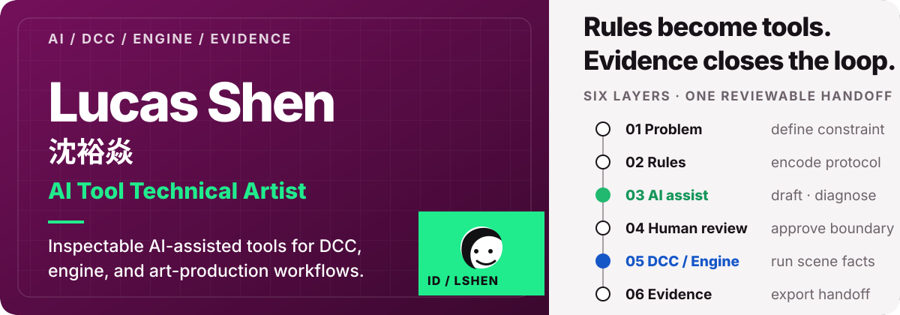
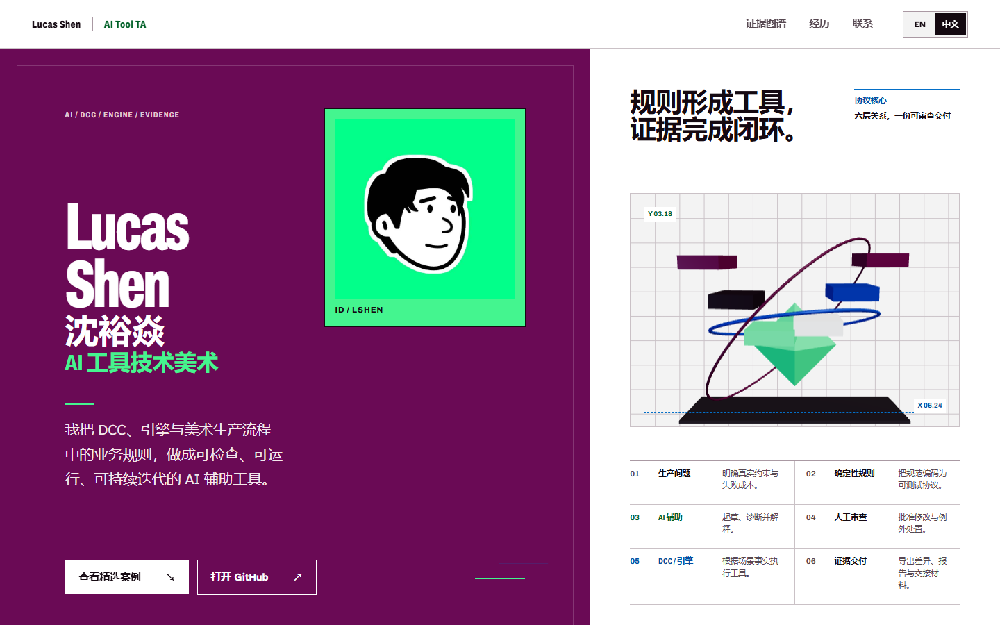
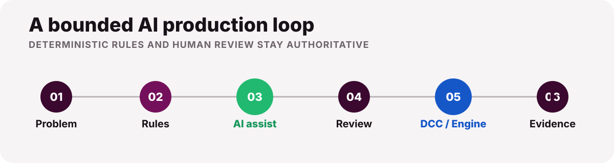

<p align="center">
  
</p>

<p align="center">
  <a href="https://ubik42.github.io/"><strong>Open the portfolio</strong></a>
  &nbsp;·&nbsp;
  <a href="#selected-systems">Selected systems</a>
  &nbsp;·&nbsp;
  <a href="#run-locally">Run locally</a>
  &nbsp;·&nbsp;
  <a href="#中文简介">中文简介</a>
</p>

<p align="center">
  A bilingual portfolio for an AI Tool Technical Artist working across DCCs, engines, web systems, and evidence-driven production workflows.
</p>

<p align="center">
  <a href="https://ubik42.github.io/">
    
  </a>
</p>

## What this portfolio is for

This site is the public front door to Lucas Shen's AI Tool Technical Art practice. It is built for technical-art leads, tools and pipeline engineers, AI-tool teams, recruiters, and collaborators who need to answer three questions quickly:

- What production problems can Lucas solve across DCC, engine, web, and AI workflows?
- Where does AI assist, and where do deterministic rules and human review stay authoritative?
- What interfaces, reports, diagrams, or runnable artifacts prove the work?

The portfolio is English-first with a complete Chinese product state. Its evidence uses public methods and synthetic cases; internal production details remain private.

## Selected systems

### 01 · Production rules across DCC and engine

A shared asset protocol and deterministic rule layer turn Maya, Blender, Unreal, and other DCC facts into reviewable publish decisions. AI may draft or explain rules; validators own status, safe-fix boundaries, scene mutation, and publish gates.

**Evidence:** protocol diffs, scene-fact collection, validation matrices, fix previews, and publish reports.

### 02 · Visual review as a reproducible contract

Fixed cameras, passes, thresholds, and handoff receipts make visual comparison repeatable. AI prepares reviewer-facing summaries without changing pass execution, thresholds, findings, or human acceptance.

**Evidence:** pass manifests, signal-to-pass traces, review queues, and release reports.

### 03 · Personal AI workflows for research and presentation

Research, presentation, and long-running agent work become resumable pipelines with explicit state, source evidence, deterministic checks, and approval gates.

**Evidence:** Slidev and Three.js studies, a 5,000+ record paper index, visual QA, and resumable jobs.

<p align="center">
  
</p>

## Design and engineering

- **Identity:** plum, signal green, anodized blue, a hand-drawn avatar, and a narrow engineered display face.
- **Evidence Atlas:** three unequal systems share protocol, rules, AI assist, DCC/engine, review, and evidence layers.
- **Accessible interaction:** semantic structure, keyboard-operable controls, visible focus states, useful alternative text, and reduced-motion behavior.
- **Bilingual product state:** English and Chinese update visible copy, document language, metadata, and persisted preference together.
- **Performance boundary:** the React Three Fiber protocol core is code-split, delayed, and backed by a static semantic fallback.

| Layer | Technology |
| --- | --- |
| Application | React 19 · TypeScript · Vite |
| Motion | Motion for React · adapted React Bits interaction |
| 3D | React Three Fiber · Three.js |
| Typography | Archivo Variable · Atkinson Hyperlegible Next |
| Publishing | GitHub Pages · `gh-pages` branch |

## Run locally

```powershell
git clone https://github.com/Ubik42/Ubik42.github.io.git
cd Ubik42.github.io
npm ci
npm run dev
```

Open the local URL printed by Vite. The language switch, Evidence Atlas, dialog interactions, keyboard navigation, responsive layouts, reduced-motion mode, and WebGL fallback are all part of the review surface.

## Quality and deployment

```powershell
npm run typecheck
npm run lint
npm run build
```

Publishing runs the same checks, builds `dist/`, and sends the result to the `gh-pages` branch used by GitHub Pages:

```powershell
npm run deploy
```

## 中文简介

这是沈裕焱的双语 AI 工具技术美术作品集，重点展示如何把 DCC、引擎与美术生产中的业务规则，转化为可检查、可运行、可持续迭代的 AI 辅助工具。

作品集以真实界面、公开合成案例、流程图和验证证据为核心，并明确区分 AI 与确定性系统的职责：AI 可以起草、诊断和解释；规则验证、场景修改、发布门禁与最终签收仍由确定性逻辑和人工评审负责。

访问线上版本：[ubik42.github.io](https://ubik42.github.io/)

## Public channels

<p>
  <a href="https://github.com/Ubik42">GitHub</a>
  &nbsp;·&nbsp;
  <a href="https://lucasshen2002.artstation.com/">ArtStation</a>
  &nbsp;·&nbsp;
  <a href="https://space.bilibili.com/12367861">Bilibili</a>
  &nbsp;·&nbsp;
  <a href="https://www.xiaohongshu.com/user/profile/670526b2000000001e001891">Xiaohongshu</a>
</p>

---

Lucas (Yuyan) Shen / 沈裕焱
