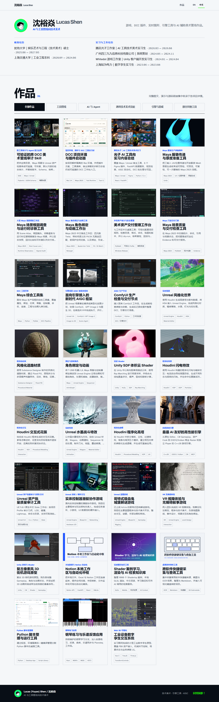

# 沈裕焱 · 技术美术与工具开发作品集

[访问个人主页](https://ubik42.github.io/)

这是面向国内技术美术、工具管线、引擎工具与 AI 工具岗位的个人作品集。网站默认使用简体中文，首页以统一橱窗展示项目，点击作品可查看完整图文、真实运行截图、演示视频与公开仓库。

当前页面重点展示四类内容：

- 游戏引擎、Gameplay 与客户端开发；
- Maya、Unreal 和桌面生产工具；
- AIGC、Agent 与 ComfyUI 工作流；
- Shader、程序化内容、绑定、动画和实时特效。

新增的 [CPU 软件光栅化实验室](https://github.com/Ubik42/NoemancerSoftwareRasterizer) 以 C++20 在 CPU 上显式完成三角形覆盖、透视正确插值、Z-Buffer 与逐像素着色，并通过十张真实输出展示基础缓冲、风格化 Shader 和 Overdraw 诊断。项目基于 MIT 许可的 TinyRenderer 教学实现扩展，主页与仓库均保留来源和素材授权边界。



## 当前工具体系

旧 `AIToolTA` 母仓与“万能管线 Agent”方向已经退役，不再作为现行作品介绍。相关能力已经按真实职责拆开：

| 项目 | 当前职责 | 展示证据 |
| --- | --- | --- |
| [Art Pipeline Skill](https://github.com/Ubik42/art-pipeline-skill) | 校验已注册工具、版本、只读能力、报告合同和执行回执 | 中文协议演示、Maya/Unreal 后台宿主验证、失败关闭测试 |
| [Asset Delivery Organizer](https://github.com/Ubik42/asset-delivery-organizer) | 外包资产扫描、规则检查、dry-run 整理、回滚、复检与收据 | 四组 CC0 合成交付、桌面工作台、多状态截图 |
| [Maya 场景交付检查器](https://github.com/Ubik42/maya-scene-checker) | Maya 拓扑、命名、引用和场景状态的只读检查与组件定位 | Maya 2025.3.3 可见宿主验收、五组场景、八张中文截图 |
| [Maya Garment Preparation](https://github.com/Ubik42/maya-garment-preparation) | 服装版片 UV/位置传递、修改前预检、执行后复检与单次 Undo | 七组 CC0 Maya 场景、真实 Maya 2025 工作台截图 |
| [Unreal Asset Batch Auditor](https://github.com/Ubik42/unreal-asset-batch-auditor) | Static Mesh 预算、LOD、材质槽和 Nanite 的只读批量审计 | UE 5.8.1 原生 Slate 面板、24 资产 Demo、JSON Evidence |
| [Rez Studio](https://github.com/Ubik42/rez-studio-launcher) | 根据项目、软件版本、插件方案和 Rez 环境启动 DCC | Windows 桌面端、项目软件库、解析与启动诊断 |
| [MayaScope](https://github.com/Ubik42/MayaIndieTool) | 大型 Maya 场景快照、依赖关系、运行时足迹和回归调查 | Maya 2025 GUI 生命周期验证、依赖与插件诊断截图 |
| [MayaCraft](https://github.com/Ubik42/MayaCraft) | 角色工作区、Rig Graph、形变诊断、动画重定向与 Contact IK | Maya 2025 中文工作区和四组真实界面截图 |

独立的 [ArtFlow Agent](https://github.com/Ubik42/ArtFlow-Agent) 负责 AIGC 生成编排；它与 Art Pipeline Skill 不共用仓库、Python 包或开发状态。

## 光子 AI 工具向实习内容总结

站内单独收录经过脱敏的实习内容总结，覆盖：

- Maya LOD 材质整理、贴图检查与宿主内 Web UI；
- Unreal 多 Actor 拍屏预设、C++ 数据结构、Python 编排与 Data Asset；
- 八个 Figma 插件，包括 AI 对话、批量翻译、任务交付、视觉检索、组件查重、母版更新和切图布局；
- FastAPI、SQLite、缩略图缓存、向量索引和插件动态注册；
- AIGC 自动化、DCC 无界面检查、跨 Maya 版本批处理与 FBX 结果复检；
- 版本化环境、增量构建、持续集成、发布和真实宿主回归。

页面只保留本人解决过的技术问题、实现方式和验证方法，不公开公司资产、账号、接口地址、内部仓库、原始截图或业务数据。

## 展示口径

- 截图来自项目实际运行界面或仓库明确标注的离屏 UI 展示，不使用设计稿冒充运行结果；
- 合成素材会记录生成方法、用途和许可证；Unreal Engine 内容只提供本机生成脚本，不重新分发引擎资产；
- 尚未完成的功能会写进“当前边界”或后续计划，不描述为现有能力；
- 每个项目的准确安装方法、支持版本、测试结果和限制以对应仓库 README 为准。

## 本地开发

```powershell
npm ci
npm run typecheck
npm run lint
npm run build
npm run dev
```

技术栈：React 19、TypeScript、Vite、Motion for React、React Three Fiber 与 Three.js。

## English summary

This repository hosts Lucas Shen's portfolio for technical art, game-engine tooling, DCC production tools, and AI-assisted art workflows. Chinese is the primary language. The former AIToolTA umbrella has been retired and replaced by focused, independently verifiable tools and a small Art Pipeline Skill.
